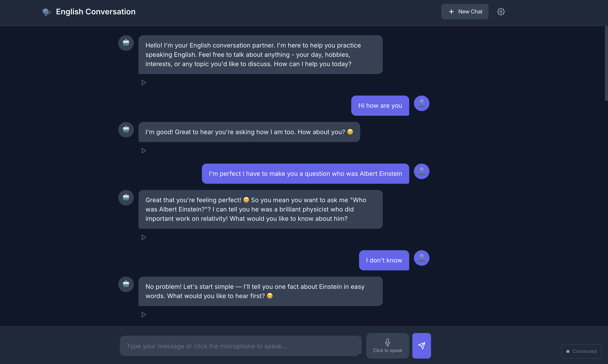

# LocalChat - English Conversation Practice

Real-time English conversation practice web application with local AI and TTS. No cloud APIs required - everything runs on your machine for complete privacy.

<p align="center">
  
</p>

## Features

- **Real-time Voice Conversation**: Practice English speaking with AI-powered responses
- **Supertonic TTS**: High-quality text-to-speech using ONNX (works on Mac/Windows/Linux)
- **LM Studio Integration**: Local AI conversation using any compatible model
- **Speech Recognition**: Speak directly using your microphone (Web Speech API)
- **WebSocket Communication**: Low-latency real-time messaging
- **Responsive UI**: Works on desktop and mobile devices
- **Conversation History**: Context-aware responses that remember the conversation
- **100% Local**: No cloud APIs, complete privacy

## Quick Start

### Prerequisites

- Python 3.10+
- [uv](https://github.com/astral-sh/uv) package manager
- [LM Studio](https://lmstudio.ai/) running with a loaded model
- Git LFS (for downloading TTS models)

### Installation by Platform

#### macOS

```bash
# Install uv and git-lfs
brew install uv git-lfs
git lfs install

# Clone and setup
git clone https://github.com/raym33/localchat.git
cd localchat
git clone https://huggingface.co/Supertone/supertonic assets
uv sync
```

#### Windows (PowerShell)

```powershell
# Install uv (run as Administrator or use winget)
powershell -ExecutionPolicy ByPass -c "irm https://astral.sh/uv/install.ps1 | iex"

# Install Git LFS (download from https://git-lfs.com or use winget)
winget install GitHub.GitLFS
git lfs install

# Clone and setup
git clone https://github.com/raym33/localchat.git
cd localchat
git clone https://huggingface.co/Supertone/supertonic assets
uv sync
```

#### Linux (Ubuntu/Debian)

```bash
# Install uv
curl -LsSf https://astral.sh/uv/install.sh | sh
source $HOME/.local/bin/env

# Install git-lfs
sudo apt-get install git-lfs
git lfs install

# Clone and setup
git clone https://github.com/raym33/localchat.git
cd localchat
git clone https://huggingface.co/Supertone/supertonic assets
uv sync
```

#### Linux (Fedora/RHEL)

```bash
# Install uv
curl -LsSf https://astral.sh/uv/install.sh | sh
source $HOME/.local/bin/env

# Install git-lfs
sudo dnf install git-lfs
git lfs install

# Clone and setup
git clone https://github.com/raym33/localchat.git
cd localchat
git clone https://huggingface.co/Supertone/supertonic assets
uv sync
```

### Configuration (Optional)

```bash
cp .env.example .env
# Edit .env with your LM Studio settings
```

### LM Studio Setup

1. Download and install [LM Studio](https://lmstudio.ai/)
2. Download a model (e.g., `qwen3-4b` or any chat model)
3. Start the local server in LM Studio (default port: 1234)
4. Update `LM_STUDIO_URL` in config if needed

### Running the App

```bash
uv run python run.py
```

Or directly with uvicorn:
```bash
uv run uvicorn backend.main:app --host 0.0.0.0 --port 8000 --reload
```

Open http://localhost:8000 in your browser.

## Usage

1. Click "Start Conversation" to begin
2. Type your message or click the microphone to speak
3. The AI will respond with text and voice
4. Practice your English conversation skills!

### Voice Input

- Click the microphone button to start speaking
- Speak clearly in English
- The app will automatically transcribe and send your message

> **Note**: For microphone access on localhost, use `http://localhost:8000` (not 127.0.0.1)

### Available Voices

The TTS system includes 4 voices:
- **F1, F2**: Female voices
- **M1, M2**: Male voices

Default is F1. You can change it in the code.

### Settings

- **Voice Speed**: Adjust playback speed (0.5x - 2.0x)
- **Auto-play Voice**: Toggle automatic audio playback
- **Show Transcription**: Show speech-to-text results while speaking
- **Speech Language**: Choose English variant (US, UK, Australian)

## Architecture

```
localchat/
├── backend/
│   ├── __init__.py
│   ├── config.py          # Configuration settings
│   ├── conversation.py    # Conversation logic & LM Studio integration
│   ├── tts_service.py     # Supertonic TTS wrapper
│   └── main.py            # FastAPI application
├── frontend/
│   └── index.html         # Main HTML page
├── static/
│   ├── css/
│   │   └── styles.css     # Application styles
│   └── js/
│       └── app.js         # Frontend JavaScript
├── assets/                # TTS models (downloaded separately)
│   ├── onnx/              # ONNX model files
│   └── voice_styles/      # Voice style files (F1, F2, M1, M2)
├── .env.example           # Environment template
├── pyproject.toml         # Python dependencies
├── run.py                 # Server runner
└── README.md
```

## API Endpoints

### REST API

- `GET /` - Serve the main application
- `GET /health` - Health check
- `POST /api/speak` - Generate speech from text
- `POST /api/conversation` - Send message and get response with audio
- `POST /api/conversation/new` - Create new conversation
- `DELETE /api/conversation/{id}` - Delete conversation

### WebSocket

- `WS /ws/{client_id}` - Real-time conversation

Message types:
- `message`: Send user text
- `clear`: Clear conversation history
- `ping`: Keep-alive

Response types:
- `ack`: Message received
- `response`: AI text response
- `audio`: Audio data (base64 WAV)
- `cleared`: Conversation cleared
- `pong`: Keep-alive response

## Configuration

| Variable | Default | Description |
|----------|---------|-------------|
| `LM_STUDIO_URL` | `http://localhost:1234` | LM Studio server URL |
| `LM_STUDIO_MODEL` | `qwen3-4b-thinking-2507` | Model name in LM Studio |
| `HOST` | `0.0.0.0` | Server host |
| `PORT` | `8000` | Server port |

## Thinking Models

If you're using a "thinking" model (like Qwen thinking variants), the app automatically strips `<think>...</think>` tags from responses, showing only the final answer.

## Troubleshooting

### No audio playing
- Make sure the `assets/` folder contains the ONNX models
- Check browser console for errors

### Microphone not working
- Use `http://localhost:8000` instead of `http://127.0.0.1:8000`
- Grant microphone permissions when prompted
- Try a different browser (Safari/Firefox are less restrictive)

### LM Studio connection failed
- Verify LM Studio server is running
- Check the URL in config matches your LM Studio settings
- Make sure a model is loaded in LM Studio

## Roadmap

Features and improvements we'd love to see:

- [ ] **Voice selection UI** - Let users choose between F1, F2, M1, M2 voices from the interface
- [ ] **Conversation export** - Save conversations as text/JSON for review
- [ ] **Vocabulary tracker** - Track new words learned during conversations
- [ ] **Grammar correction mode** - Option for more explicit grammar feedback
- [ ] **Pronunciation feedback** - Compare user pronunciation with TTS output
- [ ] **Conversation topics** - Preset topics/scenarios for guided practice
- [ ] **Progress tracking** - Statistics on conversation length, vocabulary used
- [ ] **Mobile app** - Native iOS/Android apps with offline support
- [ ] **Multiple language support** - Practice other languages beyond English
- [ ] **Docker container** - One-command deployment with Docker
- [ ] **Ollama support** - Alternative to LM Studio for local LLM

## Contributing

Contributions are welcome! This is an open source project under MIT license.

### How to Contribute

1. **Fork the repository** on GitHub
2. **Clone your fork**:
   ```bash
   git clone https://github.com/YOUR_USERNAME/localchat.git
   cd localchat
   ```
3. **Create a feature branch**:
   ```bash
   git checkout -b feature/your-feature-name
   ```
4. **Make your changes** and test them locally
5. **Commit with clear messages**:
   ```bash
   git commit -m "feat: add voice selection dropdown"
   ```
6. **Push and create a Pull Request**:
   ```bash
   git push origin feature/your-feature-name
   ```

### Development Setup

```bash
# Install dev dependencies
uv sync --extra dev

# Run tests
uv run pytest

# Format code
uv run black backend/
uv run ruff check backend/ --fix
```

### Areas Where Help is Needed

- **Frontend improvements** - Better UI/UX, mobile responsiveness
- **Testing** - Unit tests, integration tests
- **Documentation** - Tutorials, video guides
- **Translations** - README in other languages
- **Bug fixes** - Check the Issues tab

### Code Style

- Python: Follow PEP 8, use Black formatter
- JavaScript: Use modern ES6+ syntax
- Commits: Use [Conventional Commits](https://conventionalcommits.org/)

## Experimental: Mobile with Termux + Ollama

> **Note**: This is experimental and requires a powerful Android device (8GB+ RAM recommended).

You can run LocalChat entirely on your Android phone using Termux and Ollama:

### Requirements

- Android device with 8GB+ RAM
- [Termux](https://f-droid.org/packages/com.termux/) from F-Droid (not Play Store)
- ~4GB storage for a small model

### Setup

```bash
# In Termux, install dependencies
pkg update && pkg upgrade
pkg install python git

# Install Ollama (experimental ARM build)
curl -fsSL https://ollama.com/install.sh | sh

# Pull a small model (qwen2.5:1.5b works on most devices)
ollama pull qwen2.5:1.5b

# Clone LocalChat
git clone https://github.com/raym33/localchat.git
cd localchat

# Install Python dependencies
pip install -r requirements.txt

# Download TTS assets (warning: ~250MB)
git clone https://huggingface.co/Supertone/supertonic assets
```

### Running

```bash
# Terminal 1: Start Ollama server
ollama serve

# Terminal 2: Start LocalChat (modify config for Ollama)
# Edit backend/config.py: lm_studio_url = "http://localhost:11434"
python run.py
```

Open `http://localhost:8000` in your Android browser.

### Limitations

- Slow inference on mobile CPUs (expect 5-10s per response)
- TTS may be slow without GPU acceleration
- Battery drain is significant
- Web Speech API requires Chrome/Chromium

### Tips

- Use smaller models: `qwen2.5:1.5b`, `phi3:mini`, `gemma:2b`
- Keep phone plugged in during use
- Close other apps to free RAM
- Consider running server on PC, access from phone via local network

## Acknowledgments

- [Supertone](https://github.com/supertone-inc/supertonic) for the TTS model
- [LM Studio](https://lmstudio.ai/) for local LLM inference
- [Ollama](https://ollama.com/) for easy local model deployment
- Web Speech API for browser-based speech recognition

## License

MIT - See [LICENSE](LICENSE) for details.
