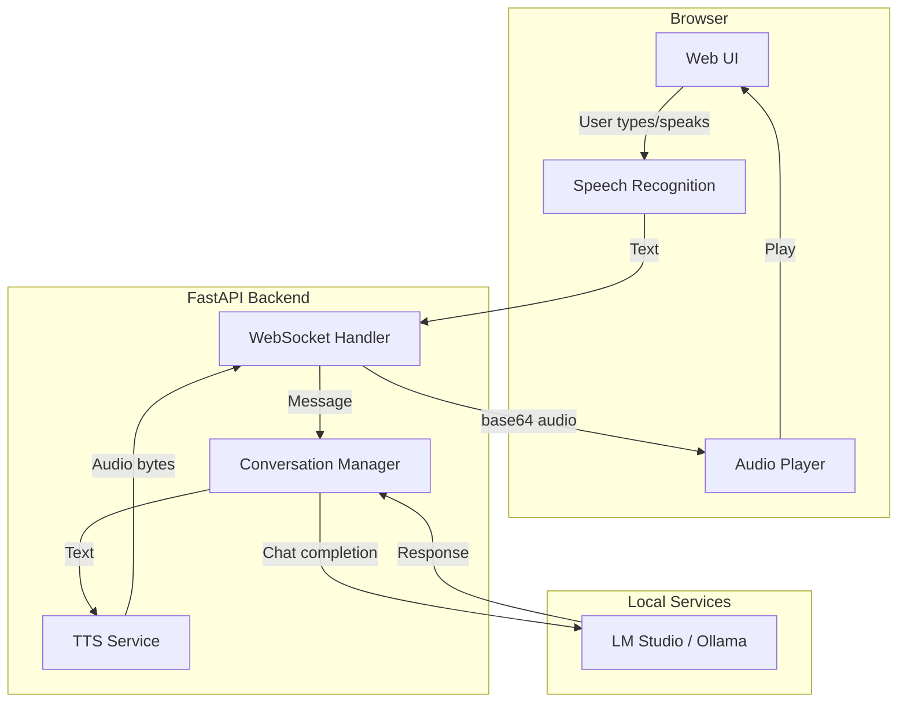
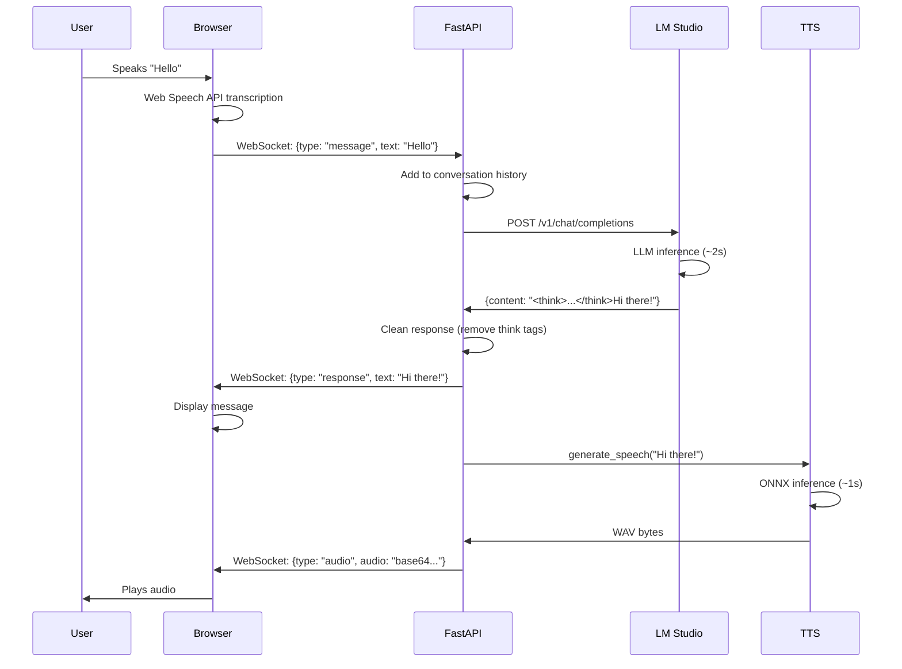
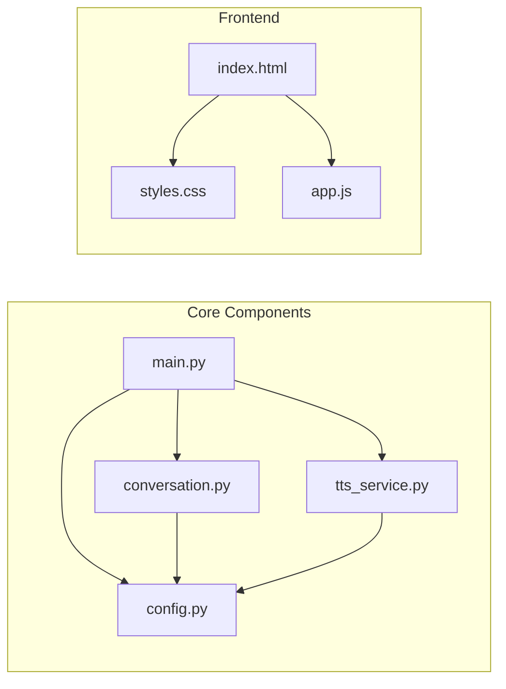
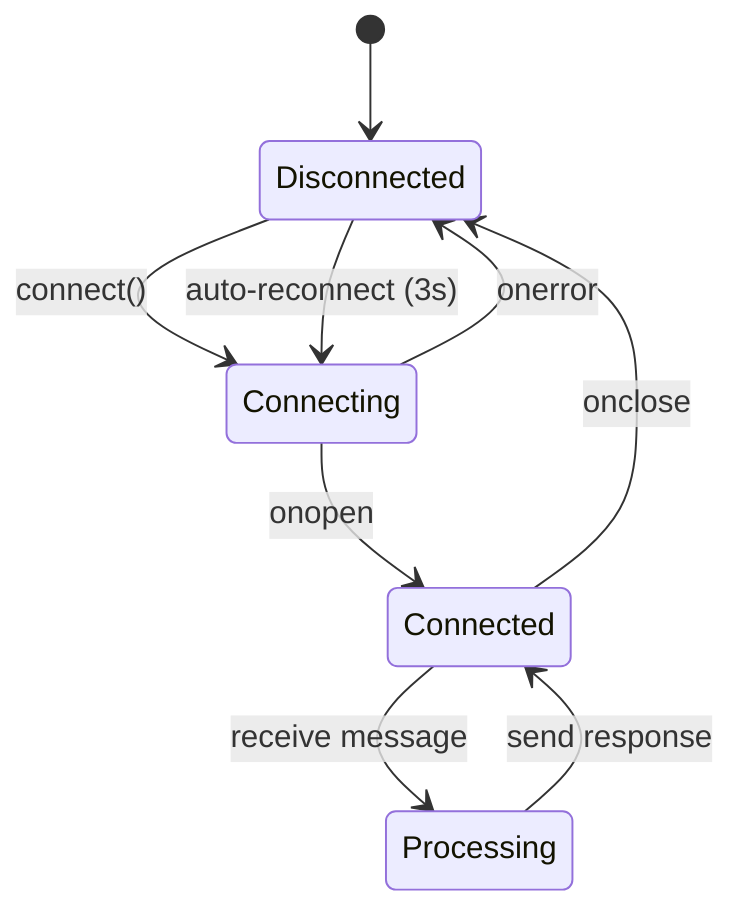

# How I Built LocalChat: A Complete Development Guide

A comprehensive guide documenting the entire process of building LocalChat - a real-time English conversation practice app with local AI and text-to-speech. This guide is for developers who want to understand the architecture, learn from the process, or build something similar.

**Time to build**: ~8 hours
**Difficulty**: Intermediate
**Prerequisites**: Python, JavaScript, basic understanding of APIs

---

## Quick Reference (TL;DR)

> **Just want to get it running?** Skip to [Step 1: Project Setup](#step-1-project-setup).
> **Want to understand the architecture?** See [Architecture Deep Dive](#architecture-deep-dive).

### The 60-Second Summary

```
┌──────────────────────────────────────────────────────────────────┐
│                        LocalChat in a Nutshell                    │
├──────────────────────────────────────────────────────────────────┤
│                                                                   │
│   User speaks → Browser STT → WebSocket → FastAPI backend        │
│                                              ↓                    │
│                                        LM Studio (local LLM)     │
│                                              ↓                    │
│   User hears ← Play audio ← WebSocket ← Supertonic TTS          │
│                                                                   │
└──────────────────────────────────────────────────────────────────┘
```

### Key Files (What Does What)

| File | Purpose | Lines |
|------|---------|-------|
| `backend/main.py` | FastAPI app, WebSocket handler | ~150 |
| `backend/conversation.py` | LLM integration, message history | ~200 |
| `backend/tts_service.py` | Text-to-speech with ONNX | ~200 |
| `frontend/index.html` | Single-page HTML | ~70 |
| `static/js/app.js` | Frontend logic, WebSocket client | ~300 |
| `static/css/styles.css` | Dark theme styling | ~300 |

### Core Dependencies

```
fastapi + uvicorn  → Web server + WebSocket
httpx              → Async HTTP for LM Studio API
onnxruntime        → Run TTS models on CPU
numpy              → Audio array processing
```

### One-Liner Architecture

**Browser** (Web Speech API + HTML/JS) ↔ **FastAPI** (WebSocket + async) ↔ **LM Studio** (local LLM) + **Supertonic** (TTS)

### Quick Commands

```bash
# Setup
git clone https://github.com/raym33/localchat && cd localchat
git clone https://huggingface.co/Supertone/supertonic assets
uv sync

# Run
uv run python run.py

# Test
uv run pytest

# Format
uv run black backend/ && uv run ruff check --fix
```

---

## Table of Contents

1. [Project Overview](#project-overview)
2. [Architecture Deep Dive](#architecture-deep-dive)
3. [Tech Stack Decisions](#tech-stack-decisions)
4. [Step 1: Project Setup](#step-1-project-setup)
5. [Step 2: Backend Core](#step-2-backend-core)
6. [Step 3: LLM Integration](#step-3-llm-integration)
7. [Step 4: Text-to-Speech Engine](#step-4-text-to-speech-engine)
8. [Step 5: Real-time Communication](#step-5-real-time-communication)
9. [Step 6: Frontend Development](#step-6-frontend-development)
10. [Step 7: Voice Input](#step-7-voice-input)
11. [Step 8: UI/UX Polish](#step-8-uiux-polish)
12. [Debugging Journey](#debugging-journey)
13. [Performance Optimization](#performance-optimization)
14. [Deployment Options](#deployment-options)
15. [Lessons Learned](#lessons-learned)
16. [Testing](#testing)
17. [Security Considerations](#security-considerations)
18. [FAQ](#frequently-asked-questions-faq)
19. [Cloud Alternatives Comparison](#cloud-alternatives-comparison)
20. [Visual Architecture (Mermaid)](#visual-architecture-mermaid-diagrams)
21. [Resources](#resources)

---

## Project Overview

### The Problem

Learning to speak English requires practice, but:
- Language tutors are expensive ($20-50/hour)
- Apps like Duolingo focus on reading/writing, not conversation
- Cloud AI services (ChatGPT Voice) require subscriptions and send data to servers
- Many learners want privacy when making mistakes

### The Solution

A free, open-source app that:
- Runs 100% locally (no internet required after setup)
- Provides real-time voice conversation with AI
- Works on any computer (Mac, Windows, Linux)
- Respects user privacy completely

### Key Requirements

| Requirement | Priority | Implementation |
|-------------|----------|----------------|
| Real-time conversation | Must have | WebSocket + async Python |
| Text-to-speech | Must have | Supertonic ONNX |
| Voice input | Must have | Web Speech API |
| 100% local | Must have | LM Studio / Ollama |
| Cross-platform | Must have | ONNX Runtime (no CUDA) |
| Low latency | Should have | WebSocket, streaming |
| Multiple voices | Nice to have | 4 voice styles (F1, F2, M1, M2) |

---

## Architecture Deep Dive

### System Architecture

```
┌─────────────────────────────────────────────────────────────────┐
│                         USER'S BROWSER                          │
│  ┌─────────────┐  ┌─────────────┐  ┌─────────────────────────┐ │
│  │   Web UI    │  │ Web Speech  │  │    Audio Playback       │ │
│  │  (HTML/JS)  │  │     API     │  │    (WAV base64)         │ │
│  └──────┬──────┘  └──────┬──────┘  └────────────┬────────────┘ │
│         │                │                       │              │
│         └────────────────┼───────────────────────┘              │
│                          │                                      │
│                    WebSocket                                    │
└──────────────────────────┼──────────────────────────────────────┘
                           │
                           ▼
┌──────────────────────────────────────────────────────────────────┐
│                      FASTAPI BACKEND                             │
│  ┌──────────────┐  ┌──────────────┐  ┌──────────────────────┐   │
│  │  WebSocket   │  │ Conversation │  │    TTS Service       │   │
│  │   Handler    │──│   Manager    │──│  (Supertonic ONNX)   │   │
│  └──────────────┘  └──────┬───────┘  └──────────────────────┘   │
│                           │                                      │
└───────────────────────────┼──────────────────────────────────────┘
                            │
                            ▼
┌──────────────────────────────────────────────────────────────────┐
│                    LM STUDIO / OLLAMA                            │
│  ┌──────────────────────────────────────────────────────────┐   │
│  │              Local LLM (Qwen, Llama, etc.)               │   │
│  │              OpenAI-compatible API on :1234              │   │
│  └──────────────────────────────────────────────────────────┘   │
└──────────────────────────────────────────────────────────────────┘
```

### Data Flow Diagram

```
USER ACTION                    BACKEND                         EXTERNAL
───────────────────────────────────────────────────────────────────────

1. User speaks
        │
        ▼
   [Browser STT] ─────► "Hello, how are you?"
        │
        ▼
2. Send via WebSocket ─────────► [Receive message]
                                        │
                                        ▼
                                 [Add to history]
                                        │
                                        ▼
3.                               [Call LM Studio] ────────► [LLM inference]
                                        │                          │
                                        │◄─────────────────────────┘
                                        │     "I'm good! How about you?"
                                        ▼
4.                               [Clean response]
                                 (remove <think> tags)
                                        │
                                        ▼
5.                    ◄──────── [Send text response]
   [Display in chat]
                                        │
                                        ▼
6.                               [Generate TTS audio]
                                 (Supertonic ONNX)
                                        │
                                        ▼
7.                    ◄──────── [Send audio (base64)]
   [Play audio]

Total latency: ~2-5 seconds (depends on LLM model size)
```

### File Structure

```
localchat/
├── backend/
│   ├── __init__.py           # Package marker
│   ├── config.py             # Configuration management
│   ├── conversation.py       # LLM conversation logic
│   ├── tts_service.py        # Text-to-speech engine
│   └── main.py               # FastAPI application
│
├── frontend/
│   └── index.html            # Single-page application
│
├── static/
│   ├── css/
│   │   └── styles.css        # UI styling (dark theme)
│   └── js/
│       └── app.js            # Frontend logic
│
├── assets/                   # TTS models (~250MB, downloaded separately)
│   ├── onnx/
│   │   ├── dec.onnx          # Decoder model
│   │   ├── dp.onnx           # Duration predictor
│   │   ├── enc.onnx          # Encoder model
│   │   ├── flow.onnx         # Flow model
│   │   └── indexer.json      # Token vocabulary
│   └── voice_styles/
│       ├── F1/               # Female voice 1
│       ├── F2/               # Female voice 2
│       ├── M1/               # Male voice 1
│       └── M2/               # Male voice 2
│
├── docs/
│   ├── screenshot.png        # UI screenshot
│   └── BUILD_GUIDE.md        # This file
│
├── .env.example              # Environment template
├── .gitignore                # Git ignore rules
├── LICENSE                   # MIT License
├── pyproject.toml            # Python dependencies
├── run.py                    # Server entry point
└── README.md                 # Project documentation
```

---

## Tech Stack Decisions

### Why Each Technology Was Chosen

| Component | Chosen | Alternatives Considered | Why This One |
|-----------|--------|------------------------|--------------|
| **Backend** | FastAPI | Flask, Django | Native async, WebSocket support, automatic API docs |
| **LLM** | LM Studio | Ollama, llama.cpp | GUI for beginners, easy model management, OpenAI-compatible |
| **TTS** | Supertonic | Dia2, Coqui, pyttsx3 | ONNX (no CUDA), high quality, multiple voices |
| **Frontend** | Vanilla JS | React, Vue, Svelte | No build step, simple, fast to develop |
| **Speech Input** | Web Speech API | Whisper, Vosk | Zero dependencies, browser-native |
| **Communication** | WebSocket | REST polling, SSE | Bidirectional, low latency |
| **Package Manager** | uv | pip, poetry, conda | Fast, reliable, modern |

### Technologies NOT Chosen (and Why)

| Technology | Why Not |
|------------|---------|
| **Dia2 TTS** | Requires CUDA/GPU - doesn't work on Mac or CPU-only machines |
| **OpenAI API** | Requires internet, costs money, privacy concerns |
| **Whisper (local)** | Adds ~1GB dependency, Web Speech API is good enough |
| **React/Vue** | Overkill for this project, adds build complexity |
| **SQLite** | Conversations don't need persistence (kept in memory) |

---

## Step 1: Project Setup

### 1.1 Create Project Directory

```bash
mkdir localchat
cd localchat
git init
```

### 1.2 Create pyproject.toml

```toml
[project]
name = "localchat"
version = "1.0.0"
description = "English conversation practice with local AI"
readme = "README.md"
license = {text = "MIT"}
requires-python = ">=3.10"
dependencies = [
    "fastapi>=0.109.0",
    "uvicorn[standard]>=0.27.0",
    "websockets>=12.0",
    "python-multipart>=0.0.6",
    "httpx>=0.26.0",
    "numpy>=1.26.0",
    "onnxruntime>=1.17.0",
]

[project.optional-dependencies]
dev = [
    "pytest>=8.0.0",
    "black>=24.1.0",
    "ruff>=0.2.0",
]

[build-system]
requires = ["hatchling"]
build-backend = "hatchling.build"

# CRITICAL: Without this, hatchling won't find the backend package
[tool.hatch.build.targets.wheel]
packages = ["backend"]

[tool.ruff]
line-length = 100
target-version = "py310"

[tool.black]
line-length = 100
target-version = ["py310"]
```

**Key Learning**: The `[tool.hatch.build.targets.wheel]` section is essential. Without it, you'll get: `Unable to determine which files to ship inside the wheel`.

### 1.3 Create Directory Structure

```bash
mkdir -p backend frontend static/css static/js docs
touch backend/__init__.py
touch backend/config.py backend/conversation.py backend/tts_service.py backend/main.py
touch frontend/index.html
touch static/css/styles.css static/js/app.js
touch run.py .env.example .gitignore
```

### 1.4 Setup .gitignore

```gitignore
# Python
__pycache__/
*.py[cod]
.venv/
venv/

# Environment
.env
.env.local

# IDE
.idea/
.vscode/
*.swp

# Generated audio
*.wav
*.mp3

# OS
.DS_Store

# uv
.uv/

# TTS assets (download separately - ~250MB)
assets/

# Temp
tmp/
*.tmp
```

### 1.5 Install Dependencies

```bash
# Install uv if not already installed
curl -LsSf https://astral.sh/uv/install.sh | sh

# Create virtual environment and install dependencies
uv sync
```

---

## Step 2: Backend Core

### 2.1 Configuration (backend/config.py)

```python
"""Configuration management for LocalChat."""

import os
from dataclasses import dataclass


@dataclass
class Config:
    """Application configuration with environment variable support."""

    # LM Studio settings
    lm_studio_url: str = "http://localhost:1234"
    lm_studio_model: str = "qwen3-4b"

    # Server settings
    host: str = "0.0.0.0"
    port: int = 8000

    # TTS settings
    tts_voice: str = "F1"  # F1, F2, M1, M2
    tts_sample_rate: int = 24000

    def __post_init__(self):
        """Override defaults with environment variables if present."""
        self.lm_studio_url = os.getenv("LM_STUDIO_URL", self.lm_studio_url)
        self.lm_studio_model = os.getenv("LM_STUDIO_MODEL", self.lm_studio_model)
        self.host = os.getenv("HOST", self.host)
        self.port = int(os.getenv("PORT", self.port))


# Global config instance
config = Config()
```

### 2.2 FastAPI Application (backend/main.py)

```python
"""FastAPI application for LocalChat."""

import asyncio
import base64
import logging
from contextlib import asynccontextmanager
from pathlib import Path

from fastapi import FastAPI, WebSocket, WebSocketDisconnect
from fastapi.middleware.cors import CORSMiddleware
from fastapi.responses import FileResponse
from fastapi.staticfiles import StaticFiles

from .config import config
from .conversation import get_conversation_manager
from .tts_service import get_tts_service

# Configure logging
logging.basicConfig(
    level=logging.INFO,
    format="%(asctime)s - %(name)s - %(levelname)s - %(message)s",
)
logger = logging.getLogger(__name__)

PROJECT_ROOT = Path(__file__).parent.parent


@asynccontextmanager
async def lifespan(app: FastAPI):
    """Application lifecycle management."""
    logger.info("Starting LocalChat server...")

    # Initialize TTS service in background (takes a few seconds)
    tts_service = get_tts_service()
    asyncio.create_task(tts_service.initialize())

    yield

    logger.info("Shutting down server...")


app = FastAPI(
    title="LocalChat",
    description="English conversation practice with local AI",
    version="1.0.0",
    lifespan=lifespan,
)

# CORS for development
app.add_middleware(
    CORSMiddleware,
    allow_origins=["*"],
    allow_methods=["*"],
    allow_headers=["*"],
)

# Static files
app.mount("/static", StaticFiles(directory=PROJECT_ROOT / "static"), name="static")


@app.get("/")
async def root():
    """Serve the main application."""
    return FileResponse(PROJECT_ROOT / "frontend" / "index.html")


@app.get("/health")
async def health():
    """Health check endpoint."""
    return {"status": "healthy"}
```

### 2.3 Entry Point (run.py)

```python
"""Server entry point."""

import uvicorn
from backend.config import config

if __name__ == "__main__":
    uvicorn.run(
        "backend.main:app",
        host=config.host,
        port=config.port,
        reload=True,  # Auto-reload during development
        log_level="info",
    )
```

---

## Step 3: LLM Integration

### 3.1 Why LM Studio?

LM Studio provides:
- **GUI**: Easy to use for non-technical users
- **Model Hub**: Browse and download models easily
- **OpenAI-compatible API**: Works with existing code
- **Cross-platform**: Mac, Windows, Linux

Alternative: **Ollama** - command-line based, lighter weight, also has OpenAI-compatible API.

### 3.2 Conversation Manager (backend/conversation.py)

```python
"""Conversation management with LM Studio integration."""

import logging
import re
from dataclasses import dataclass, field
from datetime import datetime
from typing import Optional

import httpx

logger = logging.getLogger(__name__)

# System prompt crafted for natural conversation
SYSTEM_PROMPT = """You are a friendly and patient English conversation partner helping someone practice their English speaking skills. Your role is to:

1. Engage in natural, flowing conversations on various topics
2. Respond in clear, natural English that's appropriate for conversation practice
3. Keep responses concise (1-3 sentences typically) to maintain a natural dialogue flow
4. Gently correct significant grammar or vocabulary mistakes by rephrasing correctly
5. Ask follow-up questions to keep the conversation going
6. Adapt your vocabulary and complexity to the user's apparent level
7. Be encouraging and supportive

Topics you can discuss include: daily life, hobbies, travel, food, work, culture, current events, hypothetical scenarios, opinions, and more.

Remember: This is spoken conversation practice, so keep responses natural and conversational, not formal or written-style. Do NOT use markdown formatting, asterisks, or special characters - just plain conversational text."""


@dataclass
class Message:
    """A single message in a conversation."""
    role: str  # "user" or "assistant"
    content: str
    timestamp: datetime = field(default_factory=datetime.now)


@dataclass
class Conversation:
    """A conversation session with message history."""
    id: str
    messages: list[Message] = field(default_factory=list)
    created_at: datetime = field(default_factory=datetime.now)


class ConversationManager:
    """Manages conversations and generates AI responses."""

    def __init__(self, lm_studio_url: str, model: str):
        self.lm_studio_url = lm_studio_url.rstrip("/")
        self.model = model
        self.conversations: dict[str, Conversation] = {}
        self._client: Optional[httpx.AsyncClient] = None

    @property
    def client(self) -> httpx.AsyncClient:
        """Lazy initialization of HTTP client."""
        if self._client is None:
            self._client = httpx.AsyncClient(timeout=60.0)
        return self._client

    def create_conversation(self, conversation_id: str) -> Conversation:
        """Create a new conversation session."""
        conv = Conversation(id=conversation_id)
        self.conversations[conversation_id] = conv
        return conv

    def get_conversation(self, conversation_id: str) -> Optional[Conversation]:
        """Get an existing conversation."""
        return self.conversations.get(conversation_id)

    def add_message(self, conversation_id: str, role: str, content: str) -> Message:
        """Add a message to a conversation."""
        conv = self.get_conversation(conversation_id)
        if conv is None:
            conv = self.create_conversation(conversation_id)

        message = Message(role=role, content=content)
        conv.messages.append(message)
        return message

    def _clean_response(self, text: str) -> str:
        """Clean response from thinking tags and markdown.

        Qwen thinking models output: <think>...reasoning...</think>actual response
        We only want the actual response after </think>
        """
        # Handle </think> tag - extract content AFTER it
        if '</think>' in text:
            text = text.split('</think>')[-1]
        elif '<think>' in text:
            # Model is still thinking, no response yet
            text = ""

        # Same for <thinking> tags (some models use this)
        if '</thinking>' in text:
            text = text.split('</thinking>')[-1]
        elif '<thinking>' in text:
            text = ""

        # Remove any remaining XML-like tags
        text = re.sub(r'<[^>]+>', '', text)

        # Remove markdown formatting (asterisks, underscores, backticks)
        text = re.sub(r'\*+', '', text)
        text = re.sub(r'(?<![a-zA-Z])_+|_+(?![a-zA-Z])', ' ', text)
        text = re.sub(r'```.*?```', '', text, flags=re.DOTALL)
        text = re.sub(r'`[^`]+`', '', text)

        # Clean up whitespace
        text = ' '.join(text.split())
        return text.strip()

    async def generate_response(self, conversation_id: str, user_message: str) -> str:
        """Generate an AI response to the user's message."""
        # Add user message to history
        self.add_message(conversation_id, "user", user_message)

        conv = self.get_conversation(conversation_id)

        try:
            # Build messages for API (system prompt + last 20 messages)
            messages = [{"role": "system", "content": SYSTEM_PROMPT}]
            for msg in conv.messages[-20:]:
                messages.append({"role": msg.role, "content": msg.content})

            # Call LM Studio API (OpenAI-compatible)
            response = await self.client.post(
                f"{self.lm_studio_url}/v1/chat/completions",
                json={
                    "model": self.model,
                    "messages": messages,
                    "max_tokens": 1024,  # High enough for thinking + response
                    "temperature": 0.8,  # Slightly creative
                    "stream": False,
                },
                headers={"Content-Type": "application/json"},
            )
            response.raise_for_status()

            data = response.json()
            raw_response = data["choices"][0]["message"]["content"]

            # Clean the response
            cleaned_response = self._clean_response(raw_response)

            self.add_message(conversation_id, "assistant", cleaned_response)
            return cleaned_response

        except httpx.ConnectError as e:
            logger.error(f"Cannot connect to LM Studio at {self.lm_studio_url}: {e}")
            return self._get_fallback_response(user_message)
        except Exception as e:
            logger.error(f"Error calling LM Studio API: {e}")
            return self._get_fallback_response(user_message)

    def _get_fallback_response(self, user_message: str) -> str:
        """Provide a fallback response when LM Studio is unavailable."""
        user_lower = user_message.lower()

        if any(w in user_lower for w in ["hello", "hi", "hey"]):
            return "Hello! I'd love to chat, but I'm having trouble connecting to the AI service. Please make sure LM Studio is running."

        return "I'm sorry, I'm having trouble connecting right now. Please check that LM Studio is running and try again."

    def clear_conversation(self, conversation_id: str) -> None:
        """Clear a conversation's history."""
        if conversation_id in self.conversations:
            self.conversations[conversation_id].messages.clear()

    async def close(self):
        """Close the HTTP client."""
        if self._client:
            await self._client.aclose()
            self._client = None


# Singleton pattern
_conversation_manager: Optional[ConversationManager] = None


def get_conversation_manager() -> ConversationManager:
    """Get or create the conversation manager singleton."""
    global _conversation_manager
    if _conversation_manager is None:
        from .config import config
        _conversation_manager = ConversationManager(
            lm_studio_url=config.lm_studio_url,
            model=config.lm_studio_model,
        )
    return _conversation_manager
```

### 3.3 Understanding "Thinking" Models

Some models (like Qwen3 thinking variants) output their reasoning process:

```
<think>
Okay, the user said "hello". I should respond in a friendly way.
Let me think about what to say...
I'll ask how they're doing to start a conversation.
</think>
Hi there! How are you doing today?
```

**Problem**: Without cleaning, users see the raw `<think>` content.

**Solution**: Extract only the text AFTER `</think>`:

```python
if '</think>' in text:
    text = text.split('</think>')[-1]  # Get everything after the tag
```

**Important**: `max_tokens` must be high enough (1024+) to accommodate both the thinking AND the response.

---

## Step 4: Text-to-Speech Engine

### 4.1 TTS Options Evaluated

| TTS Engine | Pros | Cons | Verdict |
|------------|------|------|---------|
| **Supertonic** | ONNX (CPU), 4 voices, high quality | 250MB download | **Selected** |
| **Dia2** | Very high quality | Requires CUDA/GPU | Won't work on Mac |
| **Coqui TTS** | Open source, many voices | Complex setup, large | Too heavy |
| **pyttsx3** | Built-in, lightweight | Robotic voice quality | Not good enough |
| **gTTS** | Easy to use | Requires internet | Not local |

### 4.2 Download Supertonic Assets

```bash
# Clone from HuggingFace (~250MB)
git clone https://huggingface.co/Supertone/supertonic assets
```

This creates:
```
assets/
├── onnx/
│   ├── dec.onnx           # Decoder
│   ├── dp.onnx            # Duration predictor
│   ├── enc.onnx           # Encoder
│   ├── flow.onnx          # Flow model
│   └── indexer.json       # Character to token mapping
└── voice_styles/
    ├── F1/                # Female voice 1 (default)
    │   ├── style_dp_onnx.npy
    │   └── style_ttl_onnx.npy
    ├── F2/                # Female voice 2
    ├── M1/                # Male voice 1
    └── M2/                # Male voice 2
```

### 4.3 TTS Service Implementation (backend/tts_service.py)

```python
"""Text-to-Speech service using Supertonic ONNX models."""

import asyncio
import io
import json
import logging
import struct
import wave
from pathlib import Path
from typing import Optional

import numpy as np
import onnxruntime as ort

logger = logging.getLogger(__name__)


class Tokenizer:
    """Convert text to token IDs for the TTS model."""

    def __init__(self, indexer: list):
        """
        Initialize tokenizer.

        Args:
            indexer: A list where index = unicode value, value = token ID
                    (NOT a dict - this was a bug source!)
        """
        self.indexer = indexer

    def _preprocess_text(self, text: str) -> str:
        """Normalize text for TTS."""
        # Convert to lowercase and strip
        text = text.strip()
        # Replace multiple spaces with single space
        text = ' '.join(text.split())
        return text

    def _text_to_unicode_values(self, text: str) -> np.ndarray:
        """Convert text to unicode values."""
        return np.array([ord(char) for char in text], dtype=np.uint16)

    def __call__(self, text_list: list[str]) -> tuple[np.ndarray, np.ndarray]:
        """Tokenize a list of texts."""
        text_list = [self._preprocess_text(t) for t in text_list]
        text_ids_lengths = np.array([len(text) for text in text_list], dtype=np.int64)
        text_ids = np.zeros((len(text_list), text_ids_lengths.max()), dtype=np.int64)

        for i, text in enumerate(text_list):
            unicode_vals = self._text_to_unicode_values(text)
            ids = []
            for val in unicode_vals:
                # indexer is a LIST, not a dict!
                if val < len(self.indexer):
                    token_id = self.indexer[val]
                    ids.append(token_id if token_id >= 0 else 0)
                else:
                    ids.append(0)  # Unknown character
            text_ids[i, :len(unicode_vals)] = np.array(ids, dtype=np.int64)

        # Create attention mask
        text_mask = np.zeros((len(text_list), text_ids_lengths.max()), dtype=np.float32)
        for i, length in enumerate(text_ids_lengths):
            text_mask[i, :length] = 1.0

        return text_ids, text_mask


class Style:
    """Voice style embeddings."""

    def __init__(self, style_ttl: np.ndarray, style_dp: np.ndarray):
        self.style_ttl = style_ttl
        self.style_dp = style_dp

    @classmethod
    def load(cls, style_dir: Path) -> "Style":
        """Load style from directory."""
        style_ttl = np.load(style_dir / "style_ttl_onnx.npy")
        style_dp = np.load(style_dir / "style_dp_onnx.npy")
        return cls(style_ttl, style_dp)


class SupertonicTTS:
    """Supertonic TTS engine using ONNX Runtime."""

    def __init__(self, assets_path: str = "assets", voice: str = "F1"):
        self.assets_path = Path(assets_path)
        self.voice = voice
        self.sample_rate = 24000

        # Will be initialized later
        self.enc_session = None
        self.dp_session = None
        self.flow_session = None
        self.dec_session = None
        self.tokenizer = None
        self.style = None
        self._initialized = False

    async def initialize(self) -> bool:
        """Load ONNX models (runs in background on startup)."""
        if self._initialized:
            return True

        try:
            logger.info("Loading TTS models...")

            onnx_dir = self.assets_path / "onnx"

            # Load ONNX sessions
            self.enc_session = ort.InferenceSession(
                str(onnx_dir / "enc.onnx"),
                providers=['CPUExecutionProvider']
            )
            self.dp_session = ort.InferenceSession(
                str(onnx_dir / "dp.onnx"),
                providers=['CPUExecutionProvider']
            )
            self.flow_session = ort.InferenceSession(
                str(onnx_dir / "flow.onnx"),
                providers=['CPUExecutionProvider']
            )
            self.dec_session = ort.InferenceSession(
                str(onnx_dir / "dec.onnx"),
                providers=['CPUExecutionProvider']
            )

            # Load tokenizer
            with open(onnx_dir / "indexer.json") as f:
                indexer = json.load(f)
            self.tokenizer = Tokenizer(indexer)

            # Load voice style
            style_dir = self.assets_path / "voice_styles" / self.voice
            self.style = Style.load(style_dir)

            self._initialized = True
            logger.info(f"TTS models loaded successfully (voice: {self.voice})")
            return True

        except Exception as e:
            logger.error(f"Failed to load TTS models: {e}")
            return False

    async def generate_speech(self, text: str) -> Optional[bytes]:
        """Generate speech audio from text."""
        if not self._initialized:
            logger.warning("TTS not initialized, skipping audio generation")
            return None

        if not text.strip():
            return None

        try:
            # Run inference in thread pool to avoid blocking
            loop = asyncio.get_event_loop()
            audio = await loop.run_in_executor(None, self._generate_audio, text)
            return self._to_wav(audio)
        except Exception as e:
            logger.error(f"TTS generation failed: {e}")
            return None

    def _generate_audio(self, text: str) -> np.ndarray:
        """Run ONNX inference to generate audio."""
        # Tokenize
        text_ids, text_mask = self.tokenizer([text])

        # Encoder
        enc_out = self.enc_session.run(None, {
            "text_ids": text_ids,
            "text_mask": text_mask,
            "style": self.style.style_ttl,
        })[0]

        # Duration predictor
        durations = self.dp_session.run(None, {
            "enc_out": enc_out,
            "text_mask": text_mask,
            "style": self.style.style_dp,
        })[0]

        # Flow
        z = self.flow_session.run(None, {
            "enc_out": enc_out,
            "durations": durations,
            "text_mask": text_mask,
        })[0]

        # Decoder
        audio = self.dec_session.run(None, {"z": z})[0]

        return audio.squeeze()

    def _to_wav(self, audio: np.ndarray) -> bytes:
        """Convert numpy audio to WAV bytes."""
        # Normalize to int16
        audio = np.clip(audio, -1.0, 1.0)
        audio_int16 = (audio * 32767).astype(np.int16)

        # Write to WAV
        buffer = io.BytesIO()
        with wave.open(buffer, 'wb') as wav:
            wav.setnchannels(1)
            wav.setsampwidth(2)  # 16-bit
            wav.setframerate(self.sample_rate)
            wav.writeframes(audio_int16.tobytes())

        return buffer.getvalue()


# Singleton
_tts_service: Optional[SupertonicTTS] = None


def get_tts_service() -> SupertonicTTS:
    """Get or create the TTS service singleton."""
    global _tts_service
    if _tts_service is None:
        from .config import config
        _tts_service = SupertonicTTS(voice=config.tts_voice)
    return _tts_service
```

### 4.4 Critical Bug Fix: Indexer Type

The original code assumed `indexer` was a dictionary:

```python
# WRONG - throws "'list' object has no attribute 'get'"
token_id = self.indexer.get(str(unicode_val), 0)
```

But it's actually a list where:
- **Index** = Unicode code point (e.g., 97 for 'a')
- **Value** = Token ID for the model

```python
# CORRECT
if unicode_val < len(self.indexer):
    token_id = self.indexer[unicode_val]
else:
    token_id = 0  # Unknown character
```

---

## Step 5: Real-time Communication

### 5.1 Why WebSocket Over REST?

| Aspect | REST | WebSocket |
|--------|------|-----------|
| Connection | New connection per request | Persistent connection |
| Latency | Higher (HTTP overhead) | Lower (no overhead) |
| Server push | Not possible (need polling) | Native support |
| Bidirectional | Request-response only | Full duplex |
| Use case | CRUD operations | Real-time apps |

For a chat app, WebSocket is clearly better.

### 5.2 Connection Manager

```python
# Add to backend/main.py

class ConnectionManager:
    """Manage WebSocket connections."""

    def __init__(self):
        self.connections: dict[str, WebSocket] = {}

    async def connect(self, websocket: WebSocket, client_id: str):
        """Accept and store a new connection."""
        await websocket.accept()
        self.connections[client_id] = websocket
        logger.info(f"Client connected: {client_id}")

    def disconnect(self, client_id: str):
        """Remove a connection."""
        self.connections.pop(client_id, None)
        logger.info(f"Client disconnected: {client_id}")

    async def send_json(self, client_id: str, data: dict):
        """Send JSON data to a specific client."""
        if client_id in self.connections:
            await self.connections[client_id].send_json(data)


connection_manager = ConnectionManager()
```

### 5.3 WebSocket Endpoint

```python
# Add to backend/main.py

@app.websocket("/ws/{client_id}")
async def websocket_endpoint(websocket: WebSocket, client_id: str):
    """WebSocket endpoint for real-time conversation."""
    await connection_manager.connect(websocket, client_id)

    conversation_manager = get_conversation_manager()
    tts_service = get_tts_service()

    # Create conversation for this client
    conversation_manager.create_conversation(client_id)

    try:
        while True:
            # Wait for message from client
            data = await websocket.receive_json()

            if data["type"] == "message":
                user_text = data["text"]

                # 1. Acknowledge receipt
                await connection_manager.send_json(client_id, {
                    "type": "ack",
                    "status": "processing"
                })

                # 2. Generate AI response
                response_text = await conversation_manager.generate_response(
                    client_id, user_text
                )

                # 3. Send text response
                await connection_manager.send_json(client_id, {
                    "type": "response",
                    "text": response_text,
                    "status": "generating_audio"
                })

                # 4. Generate and send audio
                audio_bytes = await tts_service.generate_speech(response_text)
                if audio_bytes:
                    audio_base64 = base64.b64encode(audio_bytes).decode("utf-8")
                    await connection_manager.send_json(client_id, {
                        "type": "audio",
                        "audio": audio_base64,
                        "format": "wav"
                    })

            elif data["type"] == "clear":
                conversation_manager.clear_conversation(client_id)
                await connection_manager.send_json(client_id, {
                    "type": "cleared"
                })

            elif data["type"] == "ping":
                await connection_manager.send_json(client_id, {
                    "type": "pong"
                })

    except WebSocketDisconnect:
        connection_manager.disconnect(client_id)
        conversation_manager.clear_conversation(client_id)
```

### 5.4 Message Protocol

**Client → Server:**
```json
{"type": "message", "text": "Hello, how are you?"}
{"type": "clear"}
{"type": "ping"}
```

**Server → Client:**
```json
{"type": "ack", "status": "processing"}
{"type": "response", "text": "I'm doing great! How about you?", "status": "generating_audio"}
{"type": "audio", "audio": "UklGRi...(base64)...", "format": "wav"}
{"type": "cleared"}
{"type": "pong"}
```

---

## Step 6: Frontend Development

### 6.1 HTML Structure (frontend/index.html)

```html
<!DOCTYPE html>
<html lang="en">
<head>
    <meta charset="UTF-8">
    <meta name="viewport" content="width=device-width, initial-scale=1.0">
    <title>LocalChat - English Conversation Practice</title>
    <link rel="stylesheet" href="/static/css/styles.css">
</head>
<body>
    <div class="app-container">
        <!-- Header -->
        <header class="header">
            <div class="logo">
                <span class="logo-icon">💬</span>
                <h1>English Conversation</h1>
            </div>
            <div class="header-actions">
                <button id="newChatBtn" class="btn btn-primary">
                    + New Chat
                </button>
                <button id="settingsBtn" class="btn btn-icon">
                    ⚙️
                </button>
            </div>
        </header>

        <!-- Chat Area -->
        <main class="chat-area">
            <div id="messages" class="messages">
                <!-- Messages will be inserted here -->
            </div>
        </main>

        <!-- Input Area -->
        <footer class="input-area">
            <div class="input-container">
                <input
                    type="text"
                    id="messageInput"
                    placeholder="Type your message or click the microphone to speak..."
                    autocomplete="off"
                >
                <button id="micBtn" class="btn btn-mic" title="Click to speak">
                    <span class="mic-icon">🎤</span>
                    <span class="mic-text">Click to speak</span>
                </button>
                <button id="sendBtn" class="btn btn-send" title="Send message">
                    ➤
                </button>
            </div>
        </footer>

        <!-- Connection Status -->
        <div id="connectionStatus" class="connection-status">
            <span class="status-dot"></span>
            <span class="status-text">Connecting...</span>
        </div>
    </div>

    <script src="/static/js/app.js"></script>
</body>
</html>
```

### 6.2 CSS Styling (static/css/styles.css)

```css
/* Dark theme inspired by modern chat apps */
:root {
    --bg-primary: #1a1a2e;
    --bg-secondary: #16213e;
    --bg-tertiary: #0f3460;
    --text-primary: #eaeaea;
    --text-secondary: #a0a0a0;
    --accent: #7c3aed;
    --accent-hover: #6d28d9;
    --user-message: #7c3aed;
    --assistant-message: #374151;
    --border: #2d3748;
    --success: #10b981;
    --error: #ef4444;
}

* {
    margin: 0;
    padding: 0;
    box-sizing: border-box;
}

body {
    font-family: -apple-system, BlinkMacSystemFont, 'Segoe UI', Roboto, sans-serif;
    background-color: var(--bg-primary);
    color: var(--text-primary);
    height: 100vh;
    overflow: hidden;
}

.app-container {
    display: flex;
    flex-direction: column;
    height: 100vh;
    max-width: 1200px;
    margin: 0 auto;
}

/* Header */
.header {
    display: flex;
    justify-content: space-between;
    align-items: center;
    padding: 1rem 1.5rem;
    background: var(--bg-secondary);
    border-bottom: 1px solid var(--border);
}

.logo {
    display: flex;
    align-items: center;
    gap: 0.75rem;
}

.logo-icon {
    font-size: 1.5rem;
}

.logo h1 {
    font-size: 1.25rem;
    font-weight: 600;
}

/* Chat Area */
.chat-area {
    flex: 1;
    overflow-y: auto;
    padding: 1.5rem;
}

.messages {
    display: flex;
    flex-direction: column;
    gap: 1rem;
}

.message {
    display: flex;
    gap: 0.75rem;
    max-width: 85%;
    animation: fadeIn 0.3s ease;
}

@keyframes fadeIn {
    from { opacity: 0; transform: translateY(10px); }
    to { opacity: 1; transform: translateY(0); }
}

.message.user {
    align-self: flex-end;
    flex-direction: row-reverse;
}

.message.assistant {
    align-self: flex-start;
}

.message-avatar {
    width: 36px;
    height: 36px;
    border-radius: 50%;
    display: flex;
    align-items: center;
    justify-content: center;
    font-size: 1rem;
    flex-shrink: 0;
}

.message.user .message-avatar {
    background: var(--accent);
}

.message.assistant .message-avatar {
    background: var(--bg-tertiary);
}

.message-content {
    padding: 0.875rem 1rem;
    border-radius: 1rem;
    line-height: 1.5;
}

.message.user .message-content {
    background: var(--user-message);
    border-bottom-right-radius: 0.25rem;
}

.message.assistant .message-content {
    background: var(--assistant-message);
    border-bottom-left-radius: 0.25rem;
}

/* Audio play button */
.audio-btn {
    background: none;
    border: none;
    color: var(--text-secondary);
    cursor: pointer;
    padding: 0.25rem;
    margin-top: 0.5rem;
    font-size: 1rem;
    transition: color 0.2s;
}

.audio-btn:hover {
    color: var(--text-primary);
}

/* Input Area */
.input-area {
    padding: 1rem 1.5rem;
    background: var(--bg-secondary);
    border-top: 1px solid var(--border);
}

.input-container {
    display: flex;
    gap: 0.75rem;
    align-items: center;
}

#messageInput {
    flex: 1;
    padding: 0.875rem 1rem;
    border: 1px solid var(--border);
    border-radius: 0.5rem;
    background: var(--bg-primary);
    color: var(--text-primary);
    font-size: 1rem;
    outline: none;
    transition: border-color 0.2s;
}

#messageInput:focus {
    border-color: var(--accent);
}

/* Buttons */
.btn {
    padding: 0.75rem 1rem;
    border: none;
    border-radius: 0.5rem;
    cursor: pointer;
    font-size: 0.875rem;
    font-weight: 500;
    transition: all 0.2s;
}

.btn-primary {
    background: var(--accent);
    color: white;
}

.btn-primary:hover {
    background: var(--accent-hover);
}

.btn-send {
    background: var(--accent);
    color: white;
    padding: 0.75rem 1.25rem;
    font-size: 1.25rem;
}

.btn-mic {
    display: flex;
    align-items: center;
    gap: 0.5rem;
    background: var(--bg-tertiary);
    color: var(--text-primary);
    padding: 0.75rem 1rem;
}

.btn-mic.listening {
    background: var(--error);
    animation: pulse 1.5s infinite;
}

@keyframes pulse {
    0%, 100% { opacity: 1; }
    50% { opacity: 0.7; }
}

/* Connection Status */
.connection-status {
    position: fixed;
    bottom: 1rem;
    right: 1rem;
    display: flex;
    align-items: center;
    gap: 0.5rem;
    padding: 0.5rem 1rem;
    background: var(--bg-secondary);
    border-radius: 2rem;
    font-size: 0.75rem;
    color: var(--text-secondary);
}

.status-dot {
    width: 8px;
    height: 8px;
    border-radius: 50%;
    background: var(--text-secondary);
}

.connection-status.connected .status-dot {
    background: var(--success);
}

.connection-status.disconnected .status-dot {
    background: var(--error);
}

/* Responsive */
@media (max-width: 768px) {
    .header {
        padding: 0.75rem 1rem;
    }

    .logo h1 {
        font-size: 1rem;
    }

    .mic-text {
        display: none;
    }

    .chat-area {
        padding: 1rem;
    }

    .message {
        max-width: 90%;
    }
}
```

### 6.3 JavaScript Application (static/js/app.js)

```javascript
/**
 * LocalChat - Frontend Application
 */

class ChatApp {
    constructor() {
        // Generate unique client ID
        this.clientId = crypto.randomUUID();
        this.ws = null;
        this.isConnected = false;
        this.isListening = false;
        this.recognition = null;
        this.currentAudio = null;

        // DOM elements
        this.messagesContainer = document.getElementById('messages');
        this.messageInput = document.getElementById('messageInput');
        this.sendBtn = document.getElementById('sendBtn');
        this.micBtn = document.getElementById('micBtn');
        this.newChatBtn = document.getElementById('newChatBtn');
        this.connectionStatus = document.getElementById('connectionStatus');

        // Initialize
        this.setupEventListeners();
        this.setupSpeechRecognition();
        this.connect();

        // Add welcome message
        this.addMessage('assistant',
            "Hello! I'm your English conversation partner. I'm here to help you practice speaking English. Feel free to talk about anything - your day, hobbies, interests, or any topic you'd like to discuss. How can I help you today?",
            true
        );
    }

    connect() {
        const protocol = location.protocol === 'https:' ? 'wss:' : 'ws:';
        this.ws = new WebSocket(`${protocol}//${location.host}/ws/${this.clientId}`);

        this.ws.onopen = () => {
            console.log('WebSocket connected');
            this.isConnected = true;
            this.updateConnectionStatus('connected');
        };

        this.ws.onmessage = (event) => {
            const data = JSON.parse(event.data);
            this.handleMessage(data);
        };

        this.ws.onclose = () => {
            console.log('WebSocket disconnected');
            this.isConnected = false;
            this.updateConnectionStatus('disconnected');

            // Attempt to reconnect after 3 seconds
            setTimeout(() => this.connect(), 3000);
        };

        this.ws.onerror = (error) => {
            console.error('WebSocket error:', error);
        };
    }

    handleMessage(data) {
        switch(data.type) {
            case 'ack':
                // Message received, show typing indicator
                this.showTypingIndicator();
                break;

            case 'response':
                // Hide typing indicator and show response
                this.hideTypingIndicator();
                this.addMessage('assistant', data.text);
                break;

            case 'audio':
                // Play audio
                this.playAudio(data.audio);
                break;

            case 'cleared':
                // Clear messages (keep welcome)
                this.clearMessages();
                break;

            case 'pong':
                // Connection alive
                break;
        }
    }

    setupEventListeners() {
        // Send button
        this.sendBtn.addEventListener('click', () => this.sendMessage());

        // Enter key to send
        this.messageInput.addEventListener('keypress', (e) => {
            if (e.key === 'Enter' && !e.shiftKey) {
                e.preventDefault();
                this.sendMessage();
            }
        });

        // Microphone button
        this.micBtn.addEventListener('click', () => this.toggleListening());

        // New chat button
        this.newChatBtn.addEventListener('click', () => this.newChat());
    }

    setupSpeechRecognition() {
        const SpeechRecognition = window.SpeechRecognition || window.webkitSpeechRecognition;

        if (!SpeechRecognition) {
            console.warn('Speech recognition not supported in this browser');
            this.micBtn.style.display = 'none';
            return;
        }

        this.recognition = new SpeechRecognition();
        this.recognition.continuous = false;
        this.recognition.interimResults = true;
        this.recognition.lang = 'en-US';

        this.recognition.onstart = () => {
            this.isListening = true;
            this.micBtn.classList.add('listening');
            this.messageInput.placeholder = 'Listening...';
        };

        this.recognition.onresult = (event) => {
            const transcript = Array.from(event.results)
                .map(result => result[0].transcript)
                .join('');

            // Show interim results in input
            this.messageInput.value = transcript;

            // If final result, send message
            if (event.results[0].isFinal) {
                this.sendMessage();
            }
        };

        this.recognition.onerror = (event) => {
            console.error('Speech recognition error:', event.error);
            this.stopListening();
        };

        this.recognition.onend = () => {
            this.stopListening();
        };
    }

    toggleListening() {
        if (this.isListening) {
            this.recognition.stop();
        } else {
            this.recognition.start();
        }
    }

    stopListening() {
        this.isListening = false;
        this.micBtn.classList.remove('listening');
        this.messageInput.placeholder = 'Type your message or click the microphone to speak...';
    }

    sendMessage() {
        const text = this.messageInput.value.trim();
        if (!text || !this.isConnected) return;

        // Add user message to UI
        this.addMessage('user', text);

        // Send to server
        this.ws.send(JSON.stringify({
            type: 'message',
            text: text
        }));

        // Clear input
        this.messageInput.value = '';
    }

    addMessage(role, text, skipAnimation = false) {
        const messageDiv = document.createElement('div');
        messageDiv.className = `message ${role}`;
        if (skipAnimation) messageDiv.style.animation = 'none';

        const avatar = role === 'user' ? '👤' : '🤖';

        messageDiv.innerHTML = `
            <div class="message-avatar">${avatar}</div>
            <div class="message-bubble">
                <div class="message-content">${this.escapeHtml(text)}</div>
                ${role === 'assistant' ? '<button class="audio-btn" title="Play audio">▶</button>' : ''}
            </div>
        `;

        // Store audio data for replay
        if (role === 'assistant') {
            const audioBtn = messageDiv.querySelector('.audio-btn');
            audioBtn.addEventListener('click', () => {
                if (this.lastAudioData) {
                    this.playAudio(this.lastAudioData);
                }
            });
        }

        this.messagesContainer.appendChild(messageDiv);
        this.scrollToBottom();
    }

    showTypingIndicator() {
        const indicator = document.createElement('div');
        indicator.className = 'message assistant typing-indicator';
        indicator.id = 'typingIndicator';
        indicator.innerHTML = `
            <div class="message-avatar">🤖</div>
            <div class="message-content">
                <span class="typing-dots">
                    <span>.</span><span>.</span><span>.</span>
                </span>
            </div>
        `;
        this.messagesContainer.appendChild(indicator);
        this.scrollToBottom();
    }

    hideTypingIndicator() {
        const indicator = document.getElementById('typingIndicator');
        if (indicator) indicator.remove();
    }

    playAudio(base64Audio) {
        // Stop any currently playing audio
        if (this.currentAudio) {
            this.currentAudio.pause();
        }

        // Store for replay
        this.lastAudioData = base64Audio;

        // Create and play audio
        this.currentAudio = new Audio(`data:audio/wav;base64,${base64Audio}`);
        this.currentAudio.play().catch(err => {
            console.error('Failed to play audio:', err);
        });
    }

    newChat() {
        // Send clear command to server
        this.ws.send(JSON.stringify({ type: 'clear' }));
    }

    clearMessages() {
        this.messagesContainer.innerHTML = '';
        this.addMessage('assistant',
            "Hello! I'm your English conversation partner. I'm here to help you practice speaking English. Feel free to talk about anything - your day, hobbies, interests, or any topic you'd like to discuss. How can I help you today?",
            true
        );
    }

    updateConnectionStatus(status) {
        this.connectionStatus.className = `connection-status ${status}`;
        const statusText = this.connectionStatus.querySelector('.status-text');
        statusText.textContent = status === 'connected' ? 'Connected' : 'Disconnected';
    }

    scrollToBottom() {
        this.messagesContainer.scrollTop = this.messagesContainer.scrollHeight;
    }

    escapeHtml(text) {
        const div = document.createElement('div');
        div.textContent = text;
        return div.innerHTML;
    }
}

// Initialize app when DOM is ready
document.addEventListener('DOMContentLoaded', () => {
    window.app = new ChatApp();
});
```

---

## Step 7: Voice Input

### 7.1 Web Speech API Overview

The Web Speech API provides:
- **SpeechRecognition**: Convert speech to text
- **SpeechSynthesis**: Convert text to speech (we use our own TTS instead)

Browser support:
- Chrome: Full support ✅
- Edge: Full support ✅
- Safari: Partial support ⚠️
- Firefox: Limited support ⚠️

### 7.2 Implementation Details

```javascript
setupSpeechRecognition() {
    // Handle browser prefixes
    const SpeechRecognition = window.SpeechRecognition ||
                               window.webkitSpeechRecognition;

    if (!SpeechRecognition) {
        // Hide mic button if not supported
        this.micBtn.style.display = 'none';
        return;
    }

    this.recognition = new SpeechRecognition();

    // Configuration
    this.recognition.continuous = false;      // Stop after one phrase
    this.recognition.interimResults = true;   // Show results while speaking
    this.recognition.lang = 'en-US';          // Language (en-GB, en-AU also work)

    // Event handlers
    this.recognition.onresult = (event) => {
        // Combine all results
        const transcript = Array.from(event.results)
            .map(result => result[0].transcript)
            .join('');

        // Show in input field
        this.messageInput.value = transcript;

        // Send when speech is final
        if (event.results[0].isFinal) {
            this.sendMessage();
        }
    };
}
```

### 7.3 Important: Secure Context Requirement

The Web Speech API requires a "secure context":

| URL | Works? | Notes |
|-----|--------|-------|
| `https://example.com` | ✅ Yes | Secure |
| `http://localhost:8000` | ✅ Yes | Exception for localhost |
| `http://127.0.0.1:8000` | ⚠️ Maybe | Some browsers reject this |
| `http://192.168.1.x:8000` | ❌ No | Not secure |

**Always use `http://localhost:8000`** for development.

---

## Step 8: UI/UX Polish

### 8.1 Visual Feedback

| User Action | Visual Feedback |
|-------------|-----------------|
| Message sent | Message appears instantly, typing indicator shows |
| AI responding | Typing indicator animates |
| Audio playing | Play button could show pause state |
| Microphone active | Button pulses red, placeholder changes |
| Connection lost | Status indicator turns red |

### 8.2 Accessibility Considerations

- High contrast dark theme
- Clear button labels
- Keyboard navigation (Enter to send)
- Screen reader friendly structure
- Responsive design for mobile

### 8.3 Error Handling

```javascript
// Graceful WebSocket reconnection
this.ws.onclose = () => {
    this.updateConnectionStatus('disconnected');
    setTimeout(() => this.connect(), 3000);  // Retry after 3s
};

// Audio playback fallback
this.currentAudio.play().catch(err => {
    console.error('Autoplay blocked:', err);
    // Show play button instead
});
```

---

## Debugging Journey

### Bug 1: hatchling Build Error

**Error:**
```
Unable to determine which files to ship inside the wheel
```

**Cause:** hatchling didn't know where the Python package was.

**Fix:** Add to pyproject.toml:
```toml
[tool.hatch.build.targets.wheel]
packages = ["backend"]
```

### Bug 2: Dia2 TTS Required CUDA

**Error:**
```
RuntimeError: CUDA not available
```

**Cause:** Dia2 is designed for NVIDIA GPUs only.

**Fix:** Switched to Supertonic which uses ONNX Runtime (works on CPU).

### Bug 3: No Audio (Just Noise)

**Symptom:** Audio played but was garbled noise.

**Cause:** Initial Dia2 implementation was failing silently.

**Fix:** Switched to Supertonic with proper error logging.

### Bug 4: Thinking Tags Visible

**User Report:**
```
<think> Okay, the user just greeted me with "hello"...
```

**Cause:** Qwen thinking models output reasoning in XML tags.

**Fix:**
```python
if '</think>' in text:
    text = text.split('</think>')[-1]
```

### Bug 5: Tokenizer List vs Dict

**Error:**
```
'list' object has no attribute 'get'
```

**Cause:** Assumed `indexer.json` was a dict, but it's a list.

**Fix:**
```python
# Wrong
token_id = self.indexer.get(str(val), 0)

# Correct
token_id = self.indexer[val] if val < len(self.indexer) else 0
```

### Bug 6: max_tokens Too Low

**Symptom:** Responses were cut off or incomplete.

**Cause:** `max_tokens=200` wasn't enough for thinking + response.

**Fix:** Increased to `max_tokens=1024`.

### Bug 7: Microphone on 127.0.0.1

**Error:** Browser blocked microphone access.

**Cause:** `127.0.0.1` isn't treated as localhost in all browsers.

**Fix:** Use `http://localhost:8000` instead.

---

## Performance Optimization

### Response Time Breakdown

| Component | Time | Optimization |
|-----------|------|--------------|
| WebSocket round-trip | ~10ms | Already optimal |
| LLM inference | 1-4s | Use smaller model, GPU |
| TTS generation | 0.5-2s | Already on CPU |
| Audio transfer | ~50ms | Base64 encoding |
| **Total** | **2-5s** | Acceptable |

### Optimization Strategies

1. **Parallel processing**: Generate TTS while LLM is still responding (streaming)
2. **Model selection**: Smaller models (3-4B) are faster than larger ones
3. **TTS caching**: Cache common phrases (future feature)
4. **Streaming TTS**: Send audio chunks as generated (complex)

### Memory Usage

| Component | Memory |
|-----------|--------|
| FastAPI server | ~50MB |
| TTS models loaded | ~500MB |
| LM Studio (separate) | 2-8GB (depends on model) |

---

## Deployment Options

### Option 1: Local Development

```bash
uv run python run.py
# Open http://localhost:8000
```

### Option 2: Docker (Future)

```dockerfile
FROM python:3.11-slim
WORKDIR /app
COPY . .
RUN pip install uv && uv sync
EXPOSE 8000
CMD ["uv", "run", "python", "run.py"]
```

### Option 3: LAN Access

```bash
# Server binds to 0.0.0.0 by default
uv run python run.py

# Access from other devices on LAN:
# http://192.168.1.x:8000
# Note: Microphone won't work without HTTPS
```

### Option 4: Termux (Android)

See [README.md - Experimental: Mobile with Termux + Ollama](../README.md#experimental-mobile-with-termux--ollama)

---

## Lessons Learned

### Technical Lessons

1. **ONNX is powerful**: Enables running ML models anywhere without GPU
2. **WebSocket > REST for real-time**: The UX difference is significant
3. **Start simple**: Vanilla JS is fine for many apps, no framework needed
4. **Test with real data**: "Thinking" models behave differently
5. **Read errors carefully**: Most bugs are explained in the error message

### Process Lessons

1. **Prototype first**: Get something working before optimizing
2. **Iterate on feedback**: The thinking model bug was found by testing
3. **Document as you go**: This guide was written alongside development
4. **Keep dependencies minimal**: Fewer dependencies = fewer problems

### Architecture Lessons

1. **Singleton pattern**: Works well for services (TTS, conversation manager)
2. **Async everywhere**: Python's async is great for I/O-bound apps
3. **Separation of concerns**: Backend services are cleanly separated
4. **Configuration from environment**: Makes deployment flexible

---

## Testing

### Test Strategy

| Test Type | What We Test | Tools |
|-----------|--------------|-------|
| Unit tests | Individual functions | pytest |
| Integration tests | API endpoints | pytest + httpx |
| E2E tests | Full user flows | Manual / Playwright (future) |

### Example Unit Tests

```python
# tests/test_conversation.py
import pytest
from backend.conversation import ConversationManager

class TestConversationManager:
    """Test conversation management functionality."""

    def test_create_conversation(self):
        """Test creating a new conversation."""
        manager = ConversationManager(
            lm_studio_url="http://localhost:1234",
            model="test-model"
        )
        conv = manager.create_conversation("test-123")

        assert conv.id == "test-123"
        assert len(conv.messages) == 0

    def test_add_message(self):
        """Test adding messages to conversation."""
        manager = ConversationManager(
            lm_studio_url="http://localhost:1234",
            model="test-model"
        )
        manager.create_conversation("test-123")

        msg = manager.add_message("test-123", "user", "Hello!")

        assert msg.role == "user"
        assert msg.content == "Hello!"

        conv = manager.get_conversation("test-123")
        assert len(conv.messages) == 1

    def test_clean_response_thinking_tags(self):
        """Test removal of <think> tags from response."""
        manager = ConversationManager(
            lm_studio_url="http://localhost:1234",
            model="test-model"
        )

        # Test with thinking tags
        text = "<think>Let me think about this...</think>Hello there!"
        cleaned = manager._clean_response(text)
        assert cleaned == "Hello there!"

        # Test without thinking tags
        text = "Just a normal response."
        cleaned = manager._clean_response(text)
        assert cleaned == "Just a normal response."

        # Test with markdown
        text = "Here is **bold** and *italic* text."
        cleaned = manager._clean_response(text)
        assert "**" not in cleaned
        assert "*" not in cleaned

    def test_clear_conversation(self):
        """Test clearing conversation history."""
        manager = ConversationManager(
            lm_studio_url="http://localhost:1234",
            model="test-model"
        )
        manager.create_conversation("test-123")
        manager.add_message("test-123", "user", "Hello!")
        manager.add_message("test-123", "assistant", "Hi!")

        manager.clear_conversation("test-123")

        conv = manager.get_conversation("test-123")
        assert len(conv.messages) == 0
```

### Example Integration Tests

```python
# tests/test_api.py
import pytest
from fastapi.testclient import TestClient
from backend.main import app

client = TestClient(app)

class TestHealthEndpoint:
    """Test health check endpoint."""

    def test_health_returns_200(self):
        """Health endpoint should return 200."""
        response = client.get("/health")
        assert response.status_code == 200
        assert response.json()["status"] == "healthy"

class TestRootEndpoint:
    """Test root endpoint."""

    def test_root_serves_html(self):
        """Root should serve HTML page."""
        response = client.get("/")
        assert response.status_code == 200
        assert "text/html" in response.headers["content-type"]

class TestStaticFiles:
    """Test static file serving."""

    def test_css_accessible(self):
        """CSS file should be accessible."""
        response = client.get("/static/css/styles.css")
        assert response.status_code == 200
        assert "text/css" in response.headers["content-type"]

    def test_js_accessible(self):
        """JS file should be accessible."""
        response = client.get("/static/js/app.js")
        assert response.status_code == 200
        assert "javascript" in response.headers["content-type"]
```

### Example TTS Tests

```python
# tests/test_tts.py
import pytest
import numpy as np
from backend.tts_service import Tokenizer

class TestTokenizer:
    """Test TTS tokenizer."""

    def test_preprocess_text(self):
        """Test text preprocessing."""
        # Create mock indexer (list where index = unicode, value = token_id)
        indexer = [0] * 128  # ASCII range
        for i in range(97, 123):  # a-z
            indexer[i] = i - 96  # a=1, b=2, etc.
        indexer[32] = 27  # space

        tokenizer = Tokenizer(indexer)

        # Test basic preprocessing
        result = tokenizer._preprocess_text("  Hello   World  ")
        assert result == "Hello World"

    def test_text_to_unicode_values(self):
        """Test unicode conversion."""
        indexer = [0] * 128
        tokenizer = Tokenizer(indexer)

        result = tokenizer._text_to_unicode_values("abc")

        assert len(result) == 3
        assert result[0] == 97  # 'a'
        assert result[1] == 98  # 'b'
        assert result[2] == 99  # 'c'
```

### Running Tests

```bash
# Run all tests
uv run pytest

# Run with coverage
uv run pytest --cov=backend --cov-report=html

# Run specific test file
uv run pytest tests/test_conversation.py

# Run with verbose output
uv run pytest -v

# Run only failing tests
uv run pytest --lf
```

### Test Coverage Goals

| Component | Target Coverage | Priority |
|-----------|-----------------|----------|
| `conversation.py` | 80%+ | High |
| `tts_service.py` | 70%+ | Medium |
| `main.py` | 60%+ | Medium |
| `config.py` | 90%+ | Low |

---

## Security Considerations

### What LocalChat Does Right

| Security Aspect | Implementation | Why It Matters |
|-----------------|----------------|----------------|
| **100% Local** | No external API calls | Your conversations never leave your machine |
| **No Data Storage** | In-memory only | Nothing persisted to disk |
| **No Authentication** | Single-user design | No credentials to leak |
| **No External Dependencies** | After setup, runs offline | No supply chain attacks during use |

### Potential Security Concerns

#### 1. LM Studio API Exposure

```python
# Current: Binds to all interfaces
lm_studio_url = "http://0.0.0.0:1234"

# Risk: Anyone on your network can access LM Studio
# Mitigation: Use localhost only
lm_studio_url = "http://127.0.0.1:1234"
```

#### 2. WebSocket Without Authentication

```python
# Current: Anyone can connect
@app.websocket("/ws/{client_id}")
async def websocket_endpoint(websocket: WebSocket, client_id: str):
    await connection_manager.connect(websocket, client_id)
```

**Risk**: In a multi-user environment, anyone could connect.

**Mitigation for production**:
```python
from fastapi import Depends, HTTPException
from fastapi.security import HTTPBasic, HTTPBasicCredentials

security = HTTPBasic()

async def verify_credentials(credentials: HTTPBasicCredentials = Depends(security)):
    if credentials.username != "user" or credentials.password != "password":
        raise HTTPException(status_code=401)
    return credentials.username

@app.websocket("/ws/{client_id}")
async def websocket_endpoint(
    websocket: WebSocket,
    client_id: str,
    user: str = Depends(verify_credentials)
):
    # Now authenticated
    pass
```

#### 3. Input Validation

```python
# Current: Basic text cleaning
def _clean_response(self, text: str) -> str:
    # Removes thinking tags and markdown
    pass

# Recommendation: Add input length limits
MAX_MESSAGE_LENGTH = 10000

async def generate_response(self, conversation_id: str, user_message: str) -> str:
    if len(user_message) > MAX_MESSAGE_LENGTH:
        return "Message too long. Please keep messages under 10,000 characters."
    # ... rest of method
```

#### 4. CORS in Production

```python
# Current: Allow all origins (OK for local development)
app.add_middleware(
    CORSMiddleware,
    allow_origins=["*"],
)

# Production: Restrict to specific origins
app.add_middleware(
    CORSMiddleware,
    allow_origins=["http://localhost:8000"],
)
```

### Security Checklist

- [ ] Run LM Studio on localhost only (127.0.0.1)
- [ ] Don't expose port 8000 to the internet without auth
- [ ] Keep dependencies updated (`uv sync --upgrade`)
- [ ] Review model outputs for sensitive data before sharing
- [ ] Use HTTPS if deploying beyond localhost

### What Data Is Processed?

```
┌──────────────────────────────────────────────────────────────────┐
│                     Data Flow & Storage                          │
├──────────────────────────────────────────────────────────────────┤
│                                                                   │
│  User Input          →  In-memory only  →  Discarded on restart  │
│  Conversation History →  In-memory only  →  Discarded on restart  │
│  Generated Audio      →  Base64 in memory →  Not saved to disk   │
│  TTS Models          →  Read from disk   →  assets/ folder       │
│                                                                   │
│  NOTHING is sent to external servers                             │
│  NOTHING is logged to files by default                           │
│  NOTHING persists after closing the app                          │
│                                                                   │
└──────────────────────────────────────────────────────────────────┘
```

---

## Frequently Asked Questions (FAQ)

### Setup & Installation

**Q: Do I need a GPU?**
> No! LocalChat uses ONNX Runtime which runs on CPU. A GPU helps with LM Studio inference speed, but isn't required.

**Q: How much disk space do I need?**
> - LocalChat code: ~5MB
> - TTS models (assets/): ~250MB
> - LLM model (in LM Studio): 2-8GB depending on model
> - Total: ~3-10GB

**Q: Can I use Ollama instead of LM Studio?**
> Yes! Just change the URL in config:
> ```python
> lm_studio_url = "http://localhost:11434"  # Ollama default
> ```
> And use `/api/chat` endpoint format (Ollama is OpenAI-compatible).

**Q: What Python version do I need?**
> Python 3.10 or higher. Tested on 3.10, 3.11, and 3.12.

### Usage Issues

**Q: Microphone isn't working**
> 1. Use `http://localhost:8000` (not 127.0.0.1)
> 2. Grant microphone permission when browser asks
> 3. Try Chrome/Edge (best support) instead of Firefox/Safari

**Q: No audio is playing**
> 1. Check that `assets/` folder exists with ONNX models
> 2. Check browser console for errors
> 3. Make sure autoplay isn't blocked (click in the page first)

**Q: Responses are cut off**
> Increase `max_tokens` in conversation.py:
> ```python
> "max_tokens": 2048,  # Was 1024
> ```

**Q: I see `<think>` tags in responses**
> You're using a thinking model. The code should strip these, but if not:
> ```python
> if '</think>' in text:
>     text = text.split('</think>')[-1]
> ```

**Q: LM Studio connection failed**
> 1. Make sure LM Studio is running
> 2. A model must be loaded (not just downloaded)
> 3. Local server must be started in LM Studio
> 4. Check the URL matches (default: http://localhost:1234)

### Development

**Q: How do I add a new voice?**
> Download additional voice styles to `assets/voice_styles/` and update config:
> ```python
> tts_voice: str = "M1"  # or F2, M2
> ```

**Q: How do I change the system prompt?**
> Edit `SYSTEM_PROMPT` in `backend/conversation.py`.

**Q: How do I add conversation persistence?**
> Add SQLite or JSON file storage:
> ```python
> import json
>
> def save_conversation(conv_id: str, messages: list):
>     with open(f"conversations/{conv_id}.json", "w") as f:
>         json.dump(messages, f)
> ```

**Q: Can I use a different TTS?**
> Yes, implement the same interface in `tts_service.py`:
> ```python
> async def generate_speech(self, text: str) -> Optional[bytes]:
>     # Your TTS implementation
>     return wav_bytes
> ```

### Performance

**Q: How can I make responses faster?**
> 1. Use a smaller LLM (3-4B vs 7B+ parameters)
> 2. Enable GPU in LM Studio if available
> 3. Reduce `max_tokens` if responses don't need to be long
> 4. Use a faster computer

**Q: Why is TTS slow?**
> TTS runs on CPU (ONNX). First response is slower (model loading). Subsequent responses should be 0.5-2s. For faster TTS, you could explore GPU-based options like Dia2.

---

## Cloud Alternatives Comparison

### Why Local vs Cloud?

| Factor | LocalChat (Local) | ChatGPT Voice | ElevenLabs + GPT |
|--------|------------------|---------------|------------------|
| **Cost** | Free | $20/month | $5-30/month |
| **Privacy** | 100% local | Data on servers | Data on servers |
| **Internet** | Not required | Required | Required |
| **Latency** | 2-5s | 1-2s | 2-4s |
| **Voice Quality** | Good | Excellent | Excellent |
| **Setup** | 10-30 min | 2 min | 5 min |

### Cost Analysis (1 Year)

```
┌────────────────────────────────────────────────────────────────────┐
│                    Annual Cost Comparison                          │
├────────────────────────────────────────────────────────────────────┤
│                                                                     │
│  LocalChat:     $0  (one-time setup, runs forever)                 │
│                                                                     │
│  ChatGPT Plus:  $240/year ($20/month)                              │
│                                                                     │
│  ElevenLabs:    $60-360/year (depending on usage)                  │
│    + OpenAI:    $0-50/year (API usage)                             │
│                                                                     │
│  Savings with LocalChat: $60 - $400/year                           │
│                                                                     │
└────────────────────────────────────────────────────────────────────┘
```

### When to Use What

| Use Case | Recommendation | Why |
|----------|----------------|-----|
| Learning English privately | **LocalChat** | No data sharing |
| Quick conversations | ChatGPT Voice | Lowest latency |
| Professional voice work | ElevenLabs | Highest quality |
| Offline use (travel, etc.) | **LocalChat** | Works without internet |
| Privacy-critical | **LocalChat** | 100% local |
| Easiest setup | ChatGPT Voice | Just subscribe |

### Feature Comparison

| Feature | LocalChat | ChatGPT Voice | Google Bard |
|---------|-----------|---------------|-------------|
| Voice input | Yes | Yes | Yes |
| Voice output | Yes | Yes | Yes |
| Conversation memory | Yes | Yes | Yes |
| Custom system prompt | Yes | Limited | No |
| Works offline | Yes | No | No |
| Open source | Yes | No | No |
| Multiple voices | 4 voices | 1 voice | 1 voice |
| Language learning focus | Yes | General | General |
| Custom LLM | Any local model | GPT-4 only | PaLM only |

---

## Visual Architecture (Mermaid Diagrams)

### System Overview



### Message Sequence



### Component Dependencies



### State Machine (WebSocket)



> **Note**: To render Mermaid diagrams, use a Markdown viewer that supports Mermaid (GitHub, VS Code with extension, etc.) or paste into [mermaid.live](https://mermaid.live).

---

## Resources

### Documentation

- [FastAPI Documentation](https://fastapi.tiangolo.com/)
- [FastAPI WebSockets](https://fastapi.tiangolo.com/advanced/websockets/)
- [Web Speech API (MDN)](https://developer.mozilla.org/en-US/docs/Web/API/Web_Speech_API)
- [ONNX Runtime](https://onnxruntime.ai/docs/)

### Tools

- [LM Studio](https://lmstudio.ai/) - Local LLM GUI
- [Ollama](https://ollama.com/) - Local LLM CLI
- [uv](https://github.com/astral-sh/uv) - Fast Python package manager

### Models

- [Supertonic TTS](https://huggingface.co/Supertone/supertonic) - The TTS model we use
- [Qwen Models](https://huggingface.co/Qwen) - Good for conversation
- [Llama Models](https://huggingface.co/meta-llama) - Also works well

### Related Projects

- [Dia2 TTS](https://github.com/nari-labs/dia2) - GPU-based TTS (inspiration)
- [Coqui TTS](https://github.com/coqui-ai/TTS) - Another TTS option

---

## What's Next?

Check out the [Roadmap](../README.md#roadmap) for planned features:

- [ ] Voice selection UI
- [ ] Conversation export
- [ ] Vocabulary tracker
- [ ] Docker support
- [ ] Ollama integration
- [ ] Multiple language support

**Contributions welcome!** See [Contributing Guide](../README.md#contributing).

---

*Built with Claude Code assistance. MIT License.*

*Total development time: ~8 hours*
*Lines of code: ~2000*
*Cups of coffee: ☕☕☕*
